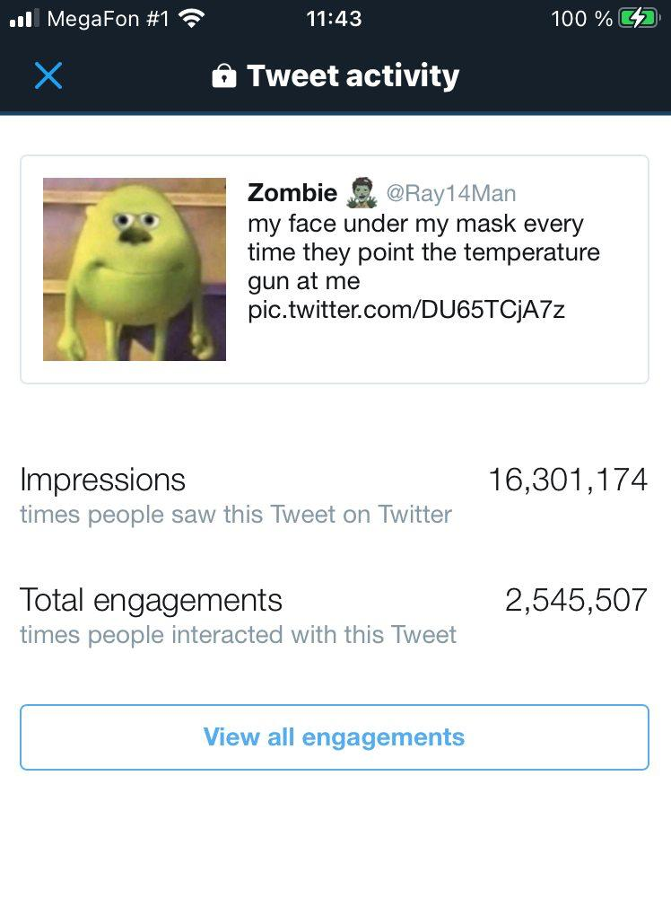
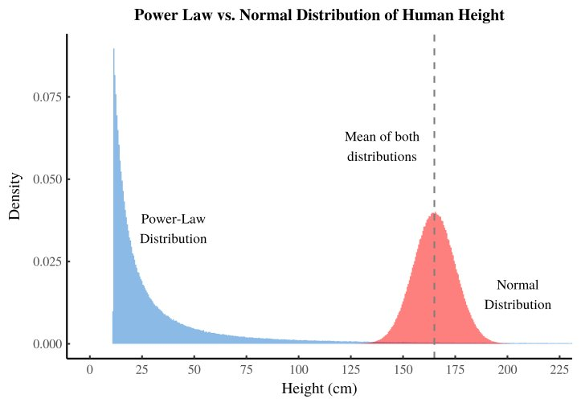
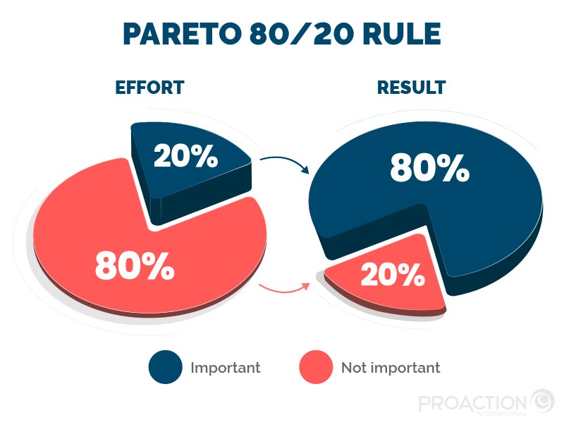
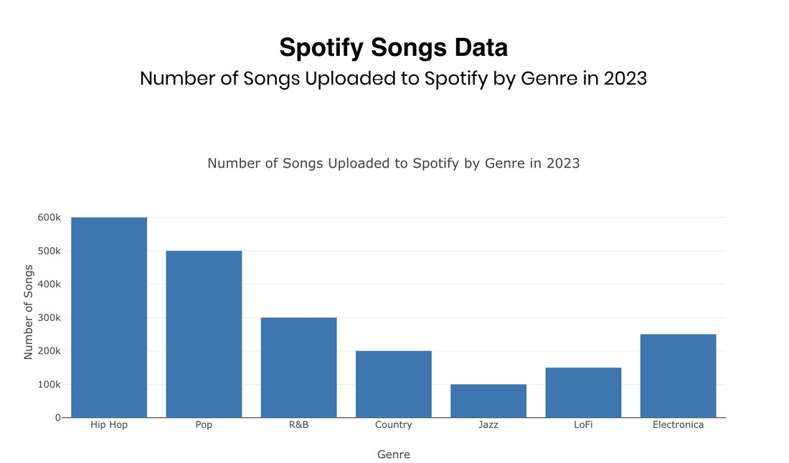
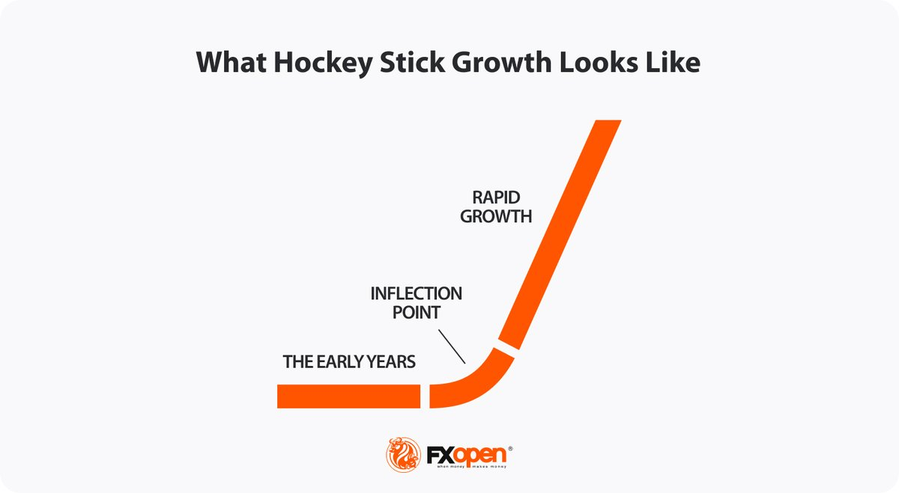
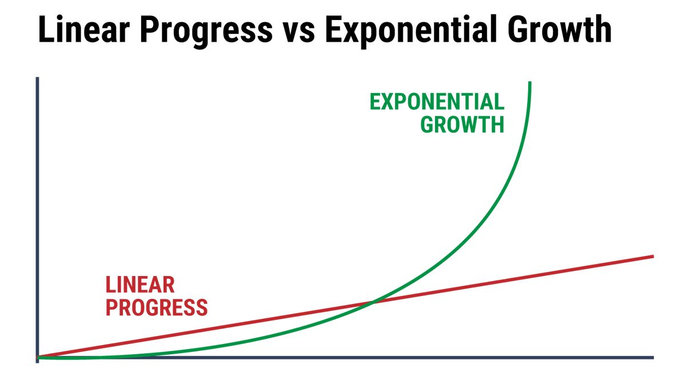

The Algorithm Behind Every Viral Post, Hit Song, and Billion-Dollar Startup - It's the Same Formula

Back in 2020 days of X my meme got 17 million views.

Not a thread. Not some 40-hour research piece. A meme I threw together in 4 minutes while sitting on the toilet lmao. Sorry for the visual but it's true.
Meanwhile in February 2026 I spent 2 weeks on an article that got 200 views. Two weeks of research, editing, rewriting. 200 views. 
I believed for years that going viral was pure luck. Like winning a scratch ticket. Luck. "The algorithm." You either hit or you don't, and nobody knows why.
Turns out there's actual math behind why this happens. Not some guru BS - real math, explaining why certain songs become hits, why certain startups become billion-dollar companies, and why 99% of everything else disappears into nothing.
It's called a power law. And once you see it, you'll never look at the world the same way.
Before we dive in, more articles, trading and interesting statistics in my Telegram channel: https://t.me/zodchixquant🧠

What is a power law and why should you care
Here is how most people think the world works:

You work twice as hard → you get twice the results. 
You post twice as much → you get twice the followers. 
You study twice as long → you learn twice as much.
Sounds fair right? Work harder = get more. That's not how any of this works and it took me embarrassingly long to figure that out.

It's completely wrong for anything that matters.
The real world runs on power laws:
y = C × x^(-α)

Translation: a tiny number of events capture 
almost ALL of the value.
In content: 1% of posts get 90% of all engagement. The other 99% split the remaining 10%.
In music: 1% of songs on Spotify get 90% of all streams. 90,000 songs are uploaded every single day. The median song gets 30 total plays. Ever.
In startups: 0.00006% of startups become unicorns. A single company in a VC portfolio often returns more than all other investments combined.
In wealth: the top 1% owns more than the bottom 50% combined.
This isn't a bug. It's the fundamental structure of how networks, attention, and money work. And if you don't understand it, you're playing the wrong game.
Why I spent 8 years not understanding this
I'm going to be honest about something embarrassing.
From age 14 to about 22, I was grinding content. Telegram groups, Reddit posts, X threads. Every single day. Posting, posting, posting.
My strategy was: more output = more results. Classic linear thinking.
And it kind of worked - in the sense that I was growing. Slowly. Painfully slowly. A few hundred followers here, a thousand there. I was proud of the consistency.
But I was playing the wrong game entirely.
Because in a power law world, 100 average posts are worth less than 1 exceptional post. Not slightly less - EXPONENTIALLY less. 
My 17M view meme did more for my growth in one day than the previous 3 months of daily posting combined.
Once I actually ran the numbers on my own content, the data was brutal:
My top 3 posts (out of hundreds): 85% of total impressions. 
Look now, top article ("Hidden Math"): more views than everything else I've ever written combined. 
Top Telegram growth day: more subs than the previous 12 months.
That's not an accident. That's a power law.
Content distribution:

Top 1% of posts:  ~ 85% of total reach
Next 9%:          ~ 10% of total reach  
Bottom 90%:       ~ 5% of total reach
The math was always there.

The same formula runs music
Ok so content I get - I've lived it. But does the same math apply to completely different fields?
Yes. 
Spotify has over 100 million songs. Here is how streams distribute:
The top 1% of artists take ~90% of all streaming revenue. The top 0.1% take over 50%. The average song uploaded to Spotify makes between $0.003 and $0.005 per stream - and the median song doesn't even get enough streams to buy a coffee.
This is why record labels don't try to make 100 "pretty good" songs. 
They throw massive resources behind 2-3 potential hits per quarter and treat everything else as lottery tickets.
Same in movies. Disney doesn't make 50 medium-budget films. They make 5-8 massive bets per year. Most of them do fine. One or two become billion-dollar franchises that fund everything else.
The formula is always the same:
Expected portfolio value = Σ (probability of mega-hit × mega-hit payoff)

The "average" outcomes barely matter.
Only the outliers drive total returns.
This is why music producers, VCs, and content creators who understand power laws behave completely differently from those who don't.
The ones who don't understand it: optimize every post, every song, every pitch to be "good." Consistent. Professional. Average.
The ones who do understand it: swing for the fences. Take big creative risks. Accept that 90% of attempts will fail - because the 10% that hit will dwarf everything else.
sorry couldn't find 2025 stats but it's just more now

And the same formula runs startups
This is where it gets really crazy.
Y Combinator has funded over 4,000 companies. 
Their total value? Over $600 billion. 
But here is the thing - a HUGE chunk of that value comes from maybe 5-10 companies. Airbnb, Stripe, Coinbase, Dropbox, Doordash.
The top ~0.25% of their portfolio = the majority of total returns.
Every VC knows this. It's called the "Babe Ruth effect" - you don't need a high batting average. You need a few home runs.
you guys want me to make an article about babe ruth effect?
Peter Thiel's $500K investment in Facebook returned over $1 billion. One bet. 2000x return. His entire career as an investor is basically that one decision.
And this is exactly why VCs behave in ways that seem irrational to normal people:
They'd rather invest in a company with a 5% chance of becoming worth $10B than a company with an 80% chance of becoming worth $50M
They encourage founders to "go big or go home" because a $50M exit doesn't move the needle
They invest in 30-50 companies knowing most will fail, because one Stripe pays for everything
Let me run the EV:
Option A: 80% × $50M = $40M expected value
Option B: 5% × $10B = $500M expected value

Option B is 12.5x better despite being far more likely to fail.
This is why "safe" startup ideas are actually the riskiest strategy from a portfolio perspective. If you're going to take the risk of starting a company at all, the math says go after the biggest possible outcome.

What this means for YOU (the action part)
Ok so power laws run content, music, startups, and wealth. Cool. What do you actually do with this?
Here's what changed for me:
1. Stop optimizing the average. Start hunting for outliers.
I used to spend equal time on every post. Edit everything the same to one "structure" I called it.
Now I batch differently. 80% of my content is "good enough" - posted fast, minimal editing, just to stay visible. 
20% of my content gets ALL of my creative energy - research, personal stories, math, visuals. Those are my power law bets.
The "Hidden Math" article took me way longer than a normal post. But it generated more value than my last 100 tweets combined. 
That's not a coincidence - that's finally understanding the distribution.
2. Volume still matters - but not for the reason you think.
"Just post more" is shitty advice if you think each post contributes equally.
"Post more" is GREAT advice if you understand that each post is a lottery ticket, and you need to buy enough tickets for the power law to work in your favor.
The math:
If P(viral) = 0.5% per post:

After 10 posts:  1 - (0.995)^10  = 4.9% chance of at least one hit
After 100 posts: 1 - (0.995)^100 = 39.4% chance
After 500 posts: 1 - (0.995)^500 = 91.8% chance
At 500 posts you're almost guaranteed at least one hit. But you can't predict WHICH one. So you need volume to let the power law do its thing.
3. When you find a hit, DOUBLE DOWN. Don't move on.
This is where most people screw up!!!
You post something that goes viral. You feel good for a day. Then you move on to the next random thing.
WRONG. A viral post is the most valuable signal you will EVER get . It tells you exactly what the market wants rn. 
The correct response is to milk it aggressively:
Write a follow-up article diving deeper
Create a thread expanding on the topic
Build a product around the interest (this is literally how @PolymarketEye started)
Turn one hit into a series
4. Apply this to your career, not just content.
Power laws don't only apply to posts and startups. They apply to skills, relationships, and career moves.
One skill that's 10x better than average is worth more than 10 skills that are 2x above average. This is why "T-shaped" people win - deep expertise in one area plus basic competence in others.
One relationship with the right person can change your entire trajectory. Not networking broadly - building 1 real connection with someone who's 2-3 steps ahead of you.
One career bet - the right company at the right time - can compress 10 years of linear growth into 2 years of exponential growth.
Linear career:    $50K → $60K → $70K → $80K → $90K (5 years)
Power law career: $50K → $50K → $50K → $200K (right bet hits)
The linear path feels safer. The power law path has higher expected value - but only if you can survive the flat years.

The dark side of power laws (that nobody talks about)
Everything I just said has a depressing corollary.
If 1% of efforts capture 90% of results... then 99% of efforts are essentially wasted. Not completely wasted - they build skill, experience, reputation. But in terms of direct results? Near zero.
This means:
Most of what you post will be seen by almost nobody. That's not a failure - that's the math.
Most startup ideas will die. Not because they're bad - because power law distributions have very few winners by definition.
Most songs will never be heard. Most books will never be read. Most products will never find market fit.
And here's the really uncomfortable part: you can't tell in advance which efforts will be the 1%. But power laws is that outlier success is fundamentally not predictable at the individual level - only statistically inevitable at scale.
This is why the ONLY strategy is:
Produce at volume (buy enough lottery tickets)
Invest disproportionately in quality on your big swings (increase each ticket's odds)
When something hits, compound it aggressively (don't waste the signal)
Have enough runway to survive the 99% that doesn't work (don't blow up before your hit arrives)
Same framework from my last three articles - EV, Kelly sizing, process over outcome, edges expire.
Everything connects!!
One last thing
I started writing articles about math and decision-making because I found the topic interesting. I didn't plan for it to become a "thing." I definitely didn't expect 5M+ views on a single article.
But looking back through the power law lens - it makes perfect sense. I posted hundreds of things over the years. Most of them disappeared. A few hit. I doubled down on what worked. And here we are.
Honestly this math is kind of depressing if you think about it too long. But it's also freeing in a weird way. Stop beating yourself up when 9 out of 10 things flop. That's not failure. That's literally the distribution working as expected. You're not doing it wrong. You just haven't hit your outlier yet.
Stop trying to make every shot count. Start taking more shots, making a few of them really count, and ruthlessly exploiting the ones that land.
The power law doesn't care about your feelings. But if you work WITH it instead of against it, the results are absurd.
More articles, experiments, and raw notes in my TG: https://t.me/zodchixquant
The math never stops 🙏🏼
