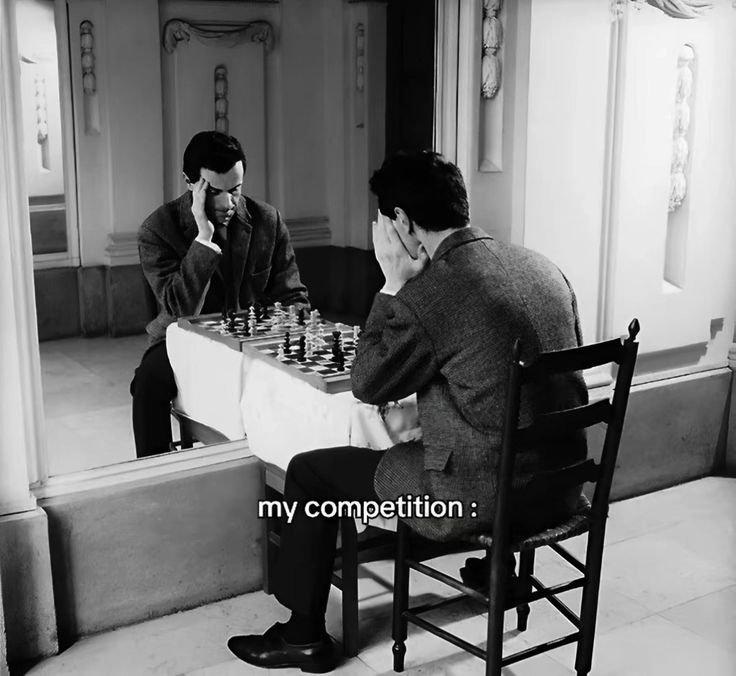
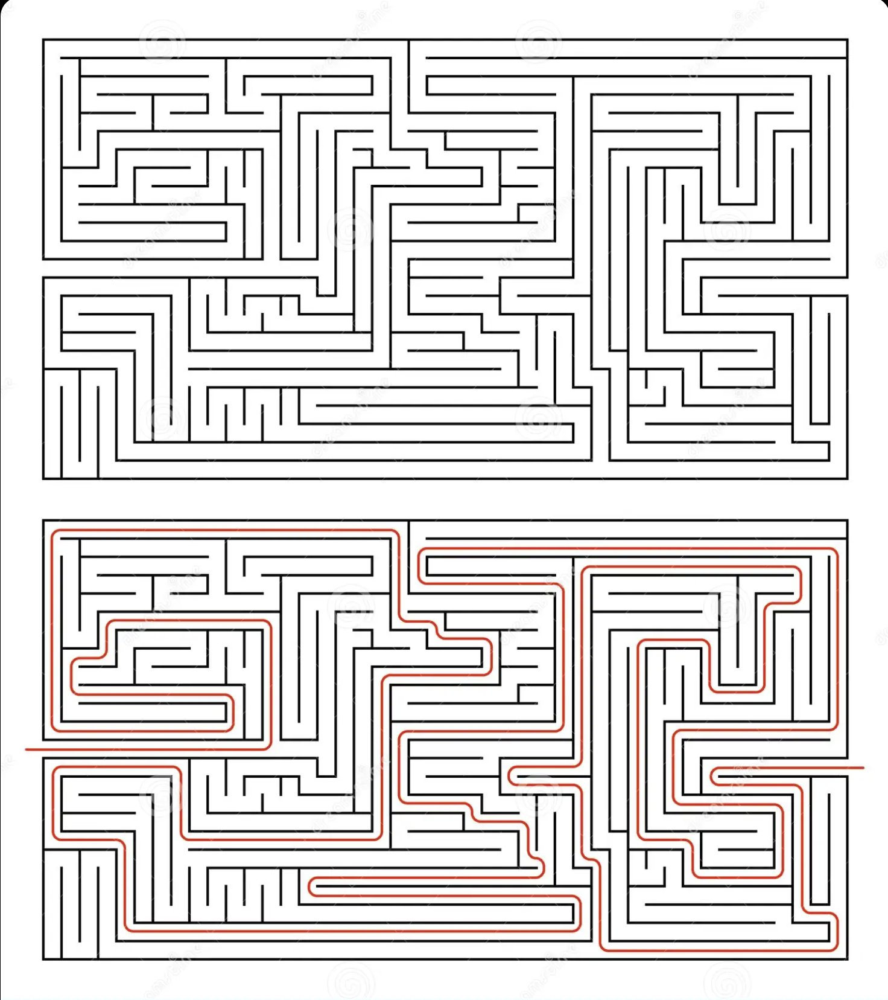
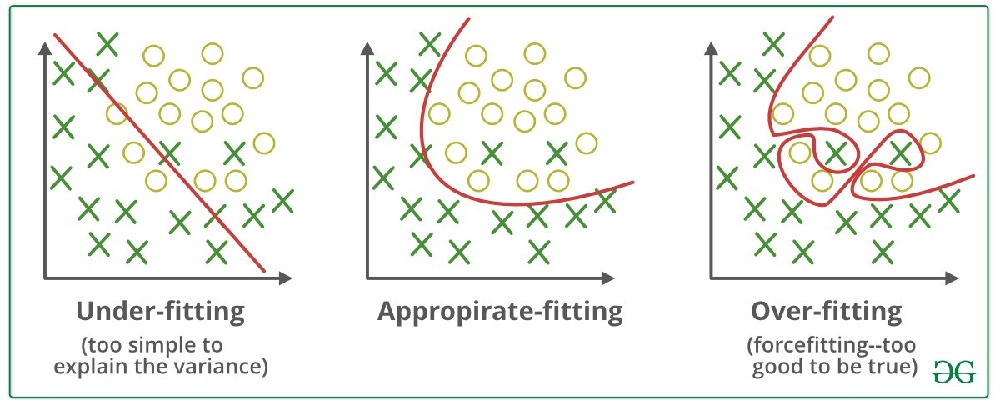
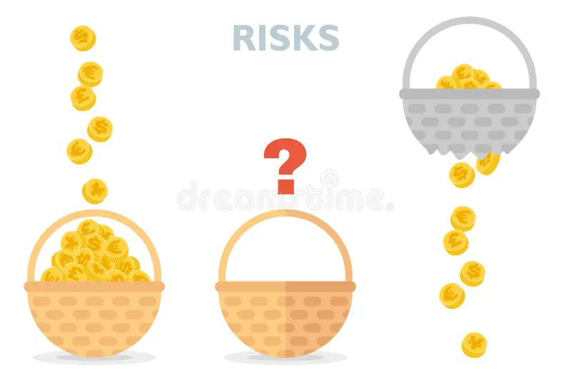

Why Smart People Stay Broke: The 5 Math Mistakes High-IQ People Make With Money.

I know a guy who can solve differential equations in his head.
Graduated top of his class. Works at a tech company you've definitely heard of. Makes $180K a year.
His net worth? Basically zero. Possibly negative if you count the car loan.
Meanwhile most of my friends dropped out before 20, went all-in on startups or trading, and are now making more than people with finance degrees. Half of them don't know simple economic terms. They just know when to act.

What's going on here?
I've noticed it a million times — strategists barely act. Have you ever wondered why university professors don't drive Ferraris? Because they theoretically know how to act, but don't know what to do in practice.

Before we dive in, more articles, trading and interesting statistics in my Telegram channel: https://t.me/zodchixquant 🧠
Now let's discuss 5 math mistakes that specifically trap smart people. And the dumb-simple fixes for each one.

Mistake #1: They optimize for precision when the game rewards action
Smart people love getting the answer exactly right. In school, that's rewarded. In a math test, 97% is worse than 100%.
In money? 97% accuracy achieved next month is worth infinitely less than 70% accuracy right now.
I watched a friend spend 2 years building a "perfect" liquidity providing project, even raised money for it. Custom indicators, backtested across 15 years, three different volatility regimes. Beautiful work honestly.
By the time he launched it, the market regime had shifted. His model was optimized for a market, that didn't exist anymore. Meanwhile some random guy on CT with a 3-line heuristic- "buy when funding is negative, sell when it's positive"- made $80K while my friend was still building.
There's actually a formula for this. It's called the value of information, and it tells you when more research is worth the delay:
VoI = EV (decision with more info) - EV (decision now) - cost of delay

If VoI < 0, stop researching and act.
The cost of delay is what smart people consistently underestimate. They think the cost is zero because research "feels productive." It's not zero. Markets move. Opportunities close. Capital sits idle.
I catch myself doing this constantly btw. In August 2025 I spent a month thinking of building a Polymarket project and I was trying to come up with something extremely complicated until the moment I literally forgot about this idea. 
Then came back in October with different mindset and just started writing code day by day. In November it was already live - @PolymarketEye.
Time wasted on "thinking of an idea" was more than actually creating it. Classic me.
The fix: Set a research deadline BEFORE you start. "I will decide by Friday with whatever information I have." This one habit alone is worth more than any formula.

Mistake #2: They see patterns in noise (and bet on them)
This is the big one. And it's uniquely a smart person problem.
If you're smart, your brain is a pattern-matching machine. It's what got you good grades, good test scores, good jobs. You see structure where others see chaos.
The problem: financial markets are mostly chaos. And your incredible pattern-matching brain will find patterns that don't exist. Then it will convince you they're real. Then you'll bet on them. Then you'll lose.
This has a name: overfitting. And there's a terrifying example of how it works.
Take any random dataset-stock prices, temperature readings, literally anything. Run enough combinations of indicators and you WILL find a formula that "predicts" the past with 95% accuracy. It'll look incredible on a backtest.
It's garbage. It found patterns in noise.
Overfitting test:

If your model has N parameters and you tested K combinations:
Expected false discoveries = K × significance_level

100 indicators tested at p < 0.05 = 5 "significant" results
that are pure noise.
I fell for this myself. 2022, I found a "pattern" in ETH that worked for 3 months of data. Something about the ratio between Binance and Coinbase volume. Looked perfect in my backtest. I was so excited I put $2K on it immediately.
Lost $400 in the first week. The pattern was noise. I just wasn't smart enough to realize that being smart enough to find it was the problem.
The Polymarket data confirms this hard. When I analyzed 112K wallets, the wallets running the most complex strategies  - 10+ signals, fancy ML models - actually underperformed wallets using 2-3 simple rules. More complexity = more overfitting = more losses.
The fix: Before trusting any pattern, ask: "If I tested 100 random strategies, how many would look this good by pure chance?" If the answer is more than 1 or 2, your "discovery" is probably noise. The Bonferroni correction is your friend: divide your significance threshold by the number of things you tested.

Mistake #3: They diversify when they should concentrate (and vice versa)
This one is heavy for me, because at couple years ago i was doing 5 different businesses at once. Failed them all.
Every smart person knows "don't put all your eggs in one basket." It's like the first rule of finance. Diversification. Modern portfolio theory. Markowitz. Nobel Prize.
Except... the actual math says something more nuanced that most people miss.
Diversifying protects you when you DON'T have edge. If you're randomly picking stocks, yeah, spread your bets. You're basically admitting you don't know what's going to happen.
But when you DO have edge - when you've genuinely identified a mispriced opportunity - it kills your returns. Because you're diluting your best idea with your mediocre ideas.
Kelly criterion for concentration:

f* = edge / odds

If your edge is 15% and odds are even:
f* = 0.15 / 1.0 = 15% of bankroll

If your edge is 3%:
f* = 0.03 / 1.0 = 3% of bankroll
The formula literally tells you: big edge = big bet, small edge = small bet. It does NOT say "spread everything equally across 47 positions."
Warren Buffett - who is actually good at this - has said multiple times that diversification is protection against ignorance. If you know what you're doing, it makes no sense.
I used to hold 5-10 different tokens during SOL and BSC seasons. My best performer was up 120% but it was 4% of my portfolio so it added like $80 total. Meanwhile my biggest bag was down 40%.
Meanwhile the top Polymarket wallets I studied hold 3-5 positions at any time. That's it. But each one is sized according to their edge.
The fix: Ask yourself honestly- do I have edge on this specific trade? If yes, size up (within Kelly bounds). If no, either skip it entirely or index. The middle ground - "I'll put a little bit in everything" - is where returns go to die.

Mistake #4: They anchor to irrelevant numbers
Smart people are especially susceptible to anchoring because they REMEMBER numbers. And remembered numbers become unconscious reference points for all future decisions.
"I bought ETH at $4,800."
Cool. The market does not care. That number is completely, totally, 100% irrelevant to whether ETH is a good buy today. But your brain has welded $4,800 to your identity. Now every price below it feels like a "loss" and every price above it feels like "recovery."
This is not just feelings. It changes behavior in measurable ways:
You hold losing positions too long (waiting to "get back to even")
You sell winning positions too early (scared of "giving back" gains from your anchor)
You evaluate new opportunities relative to old prices instead of future value
There's a stupid simple test for this. Daniel Kahneman called it the "would I buy this today?" test:
You hold an asset at current price P.
You bought at price P_0.

Ignore P_0 entirely. It's sunk.

Question: If you had cash right now, 
would you buy this asset at price P?

If yes → hold
If no → sell
If not sure → your position is too large
I had to literally write this on a sticky note on my monitor. "WOULD I BUY THIS TODAY?" Because even knowing the bias, I still catch myself thinking "but I'm only down 20%, let me wait for a bounce." The anchor is that powerful.
This extends way beyond trading btw. Salary negotiation? If your current salary is $90K, you anchor there and ask for $100K. But the market rate for your role might be $130K. You're negotiating against yourself using an irrelevant anchor. Job switching? "I've been here 4 years." So what? The question is whether the NEXT 4 years are better spent here or somewhere else. The past years are spent regardless.
The fix: Before any financial decision, write down which numbers are influencing you. Then ask: "Is this number actually relevant to the FUTURE outcome, or am I anchored to history?" If it's history, cross it out. Literally. With a pen.

Mistake #5: They mistake understanding for doing
This is the cruelest one. And I'm going to be honest - this is my biggest personal weakness.
Smart people read about compound interest and nod. They understand Kelly criterion conceptually. They can explain loss aversion at a dinner party. They've read Thinking Fast and Slow (or at least the summary).
And they think understanding = doing.
It doesn't. Not even close.
Understanding compound interest doesn't mean you're investing. Understanding Kelly doesn't mean you're sizing positions correctly. Understanding loss aversion doesn't make you immune to it.
There's research on this. It's called the "knowledge-behavior gap" and it's enormous. One study found that financial knowledge (literacy) scores have basically ZERO correlation with actual financial outcomes. People who scored 95% on a financial literacy test were just as likely to carry credit card debt as people who scored 50%.
Financial outcome = knowledge × action × consistency

If action = 0, outcome = 0.
No matter how large knowledge is.
The formula is obvious. But smart people get stuck on the first term. They keep adding to their knowledge - one more book, one more course, one more podcast - because learning feels good and safe. Action feels risky and uncomfortable.
I know because I've done it. I read 3 books about investing before making my first trade. I could explain the efficient market hypothesis, factor investing, options pricing - all of it. My first actual trade? I panicked and sold at a 12% loss in 3 days LMAO. All that knowledge, and my emotions still ran the show.
You know what finally helped? I was literally on a basketball court, pulled out my phone, and placed a $50 bet on Polymarket just to try it. Not $5,000. Just $50. Low stakes, real skin in the game, almost no chance to win — but I wanted to feel what it's like to bet the game.
Suddenly all those probability formulas weren't abstract anymore. They were attached to MY money. That $50 bet taught me more about my own biases than 11 books combined.

The fix: After you finish this article, do ONE thing. Not five things. One. Go make a small bet, calculate one EV, check one assumption. The gap between knowing and doing closes one tiny action at a time.
Why this matters more than you think
Here's what bugs me about all of this.
These 5 mistakes aren't about being dumb. They're about being smart in the wrong way. School trained us to be thorough, precise, and knowledgeable. Markets reward being fast, approximate, and active.
The rules flipped and nobody told us.
The good news? Once you see these traps, you can't unsee them. Every time you catch yourself spending 3 hours researching a $200 decision — that's Mistake #1. Every time you find an exciting "pattern" in crypto charts — that's Mistake #2. Every time you spread money across 20 positions because "diversification" — that's Mistake #3.
The smartest move a smart person can make is to get dumber. Simpler strategies. Fewer positions. Faster decisions. Less research, more action.
The math backs it up. The 112,000 wallets I studied prove it. The books prove it. My own expensive mistakes prove it.
Now stop reading and go do something with it.
Thanks for reading! 

More articles about decision-making / statistics / prediction markets in my TG channel ! 🧠
https://t.me/zodchixquant
